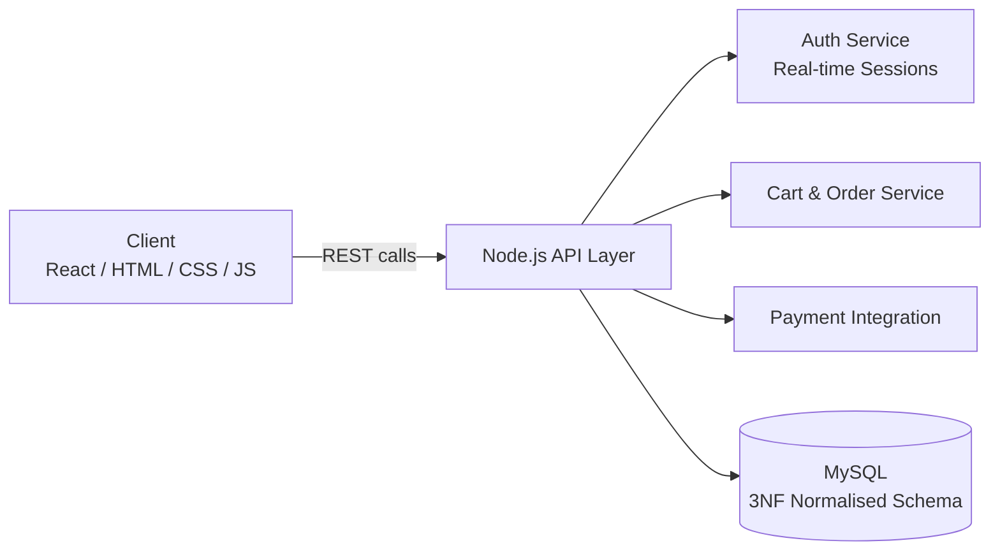

# NeuralArtX — Full-Stack Art Commerce Platform

**A dynamic e-commerce platform for buying and selling artwork, with real-time auth, cart management, and secure payments.**

> **Note on this repository:** This is a technical write-up of the system's design, not the original source tree. It documents the schema design and architecture decisions.

---

## Overview

An e-commerce platform for a niche catalog (artwork) has different demands than a generic storefront: high-resolution media, one-of-a-kind inventory (no "50 in stock"), and a schema that needs to stay clean as product attributes grow.

## My Role

Designed and built the full stack — Node.js REST API, MySQL schema, and the client-facing HTML/CSS/JS (and React) frontend.

## Architecture

## Key Design Decisions

- **3NF normalization over a flat product table.** With artwork, attributes like artist, medium, dimensions, and provenance don't fit neatly into a single row without heavy duplication. Normalizing to third normal form kept writes cheap and avoided update anomalies as the catalog grew, at the cost of slightly more complex joins on reads — a trade-off worth it for a write-heavy, evolving catalog.
- **Node.js for the API layer.** Non-blocking I/O suited a storefront where most operations (catalog lookups, cart updates) are I/O-bound rather than CPU-bound.
- **Real-time authentication.** Session state needed to reflect cart and order changes immediately across the UI, which shaped the choice of a real-time auth/session layer rather than simple stateless tokens alone.

## Key Features

- Real-time authentication and session management
- Dynamic cart with live updates
- Secure payment integration
- Normalized MySQL schema optimized for query performance and data integrity

## Challenges

Keeping query performance reasonable after normalization was the main tension — some catalog-browsing queries needed several joins. This was mitigated with targeted indexes on the most frequently filtered columns (artist, category, price range).

## Outcome

A functional full-stack storefront demonstrating schema design, real-time state management, and secure transaction handling for a niche commerce use case.
