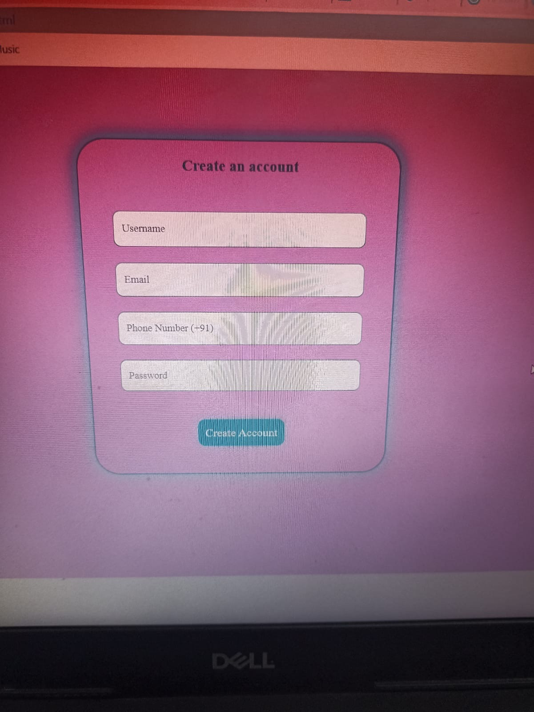
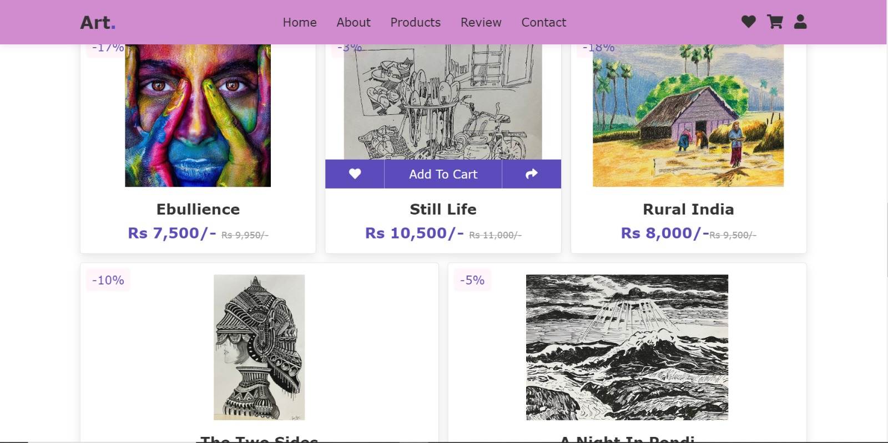
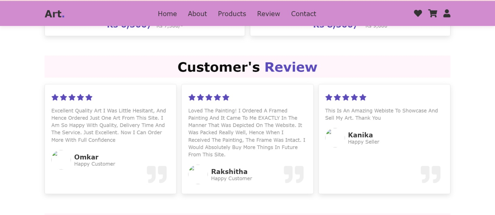
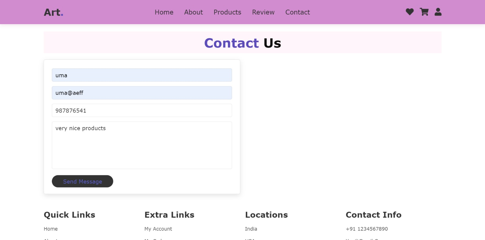
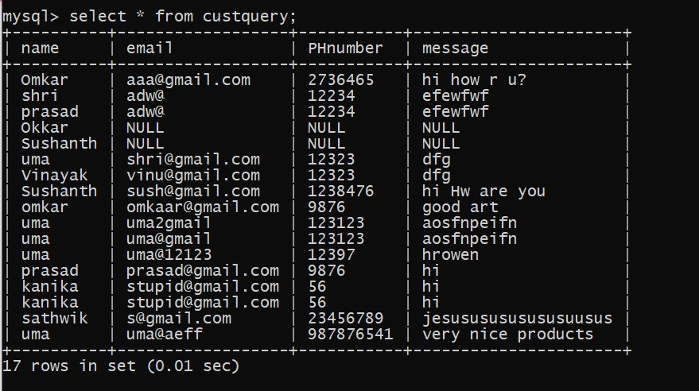
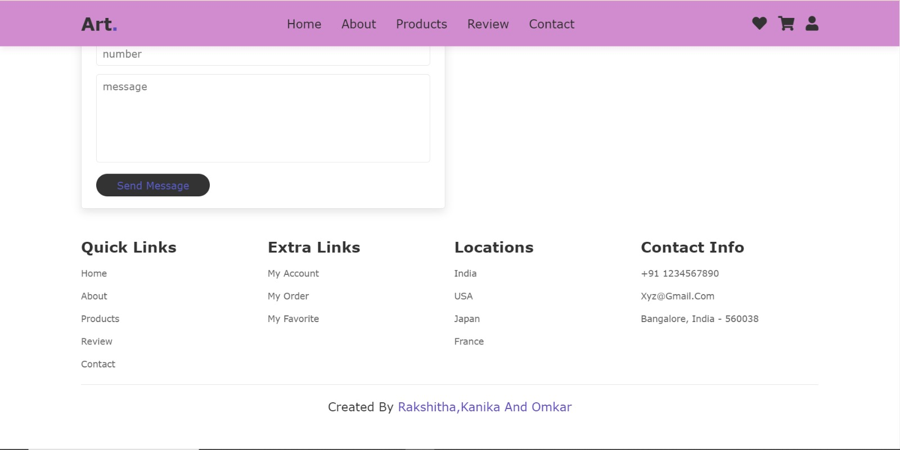

# NeuralArtX

**A full-stack art e-commerce platform with JWT authentication, Razorpay payments, and a normalised relational database — connecting artists with buyers online.**

      

> **Note on this repository:** This is a technical write-up of the system's design, architecture, and implementation — not the original source tree. It documents the approach, decisions, and trade-offs made while building the project.

---

## Overview

Artists — especially emerging ones — face a real problem: gallery exhibitions are expensive, local markets are limited, and most e-commerce platforms aren't designed for original artwork. NeuralArtX is a purpose-built web storefront where artists list work with pricing and discounts, and buyers can register, browse, add items to a cart, pay securely via Razorpay, and leave reviews — all backed by a normalised MySQL database and JWT-based session management.

## My Role

This was a team project. My contributions:
- Designed and implemented the Node.js backend — REST API routes, MySQL integration, JWT authentication layer, and Razorpay payment flow
- Built the responsive frontend layout across all sections (product grid, cart interactions, contact form)
- Designed the relational schema (4 tables, normalised to 3NF) with ER modelling
- Almost all the artwork featured on the platform is my own — the project doubled as a real showcase for pieces I'd been painting and illustrating independently

## Architecture

```
┌─────────────────────────────────────────────────────────────┐
│                     Browser (Client)                        │
│                                                             │
│  ┌────────────┐  ┌──────────────┐  ┌─────────────────────┐ │
│  │  HTML/CSS   │  │  Swiper.js   │  │    Vanilla JS       │ │
│  │  Sections   │  │  Carousels   │  │  • Login/Register   │ │
│  │  (5 pages)  │  │              │  │  • Token storage    │ │
│  │             │  │              │  │  • Cart logic        │ │
│  │             │  │              │  │  • Razorpay checkout │ │
│  └────────────┘  └──────────────┘  └──────────┬──────────┘ │
│                                                │            │
└────────────────────────────────────────────────┼────────────┘
                                                 │
                              Authorization: Bearer <JWT>
                                                 │
                                                 ▼
                              ┌──────────────────────────────┐
                              │       Node.js Backend         │
                              │                               │
                              │  ┌─────────────────────────┐  │
                              │  │    verifyToken (JWT)     │  │
                              │  │    middleware layer      │  │
                              │  └────────────┬────────────┘  │
                              │               │               │
                              │  ┌────────────▼────────────┐  │
                              │  │      API Routes          │  │
                              │  │  • POST /api/register    │  │
                              │  │  • POST /api/login       │  │
                              │  │  • POST /api/orders      │  │
                              │  │  • POST /api/payment     │  │
                              │  │  • POST /api/contact     │  │
                              │  └────────┬──────────┬─────┘  │
                              │           │          │        │
                              └───────────┼──────────┼────────┘
                                          │          │
                                ┌─────────▼──┐  ┌───▼──────────┐
                                │   MySQL     │  │   Razorpay   │
                                │  (project)  │  │   Gateway    │
                                │             │  │              │
                                │  • users    │  │  • Order     │
                                │  • artwork  │  │    creation  │
                                │  • orders   │  │  • Payment   │
                                │  • cust_    │  │    verify    │
                                │    query    │  │              │
                                └─────────────┘  └──────────────┘
```

## Key Features

### JWT Authentication
Users register with a username, email, phone, and password. Passwords are hashed with bcrypt before storage. On login, the backend verifies credentials against MySQL, then issues a signed JWT (24h expiry). Every subsequent request — cart, orders, payment — carries the token in the `Authorization` header, validated by middleware without hitting the database again.

→ **[Full auth deep-dive with code](docs/jwt-auth.md)**

### Secure Payments (Razorpay)
When a buyer clicks "Add to Cart" and checks out, the backend creates a Razorpay order, the frontend opens the Razorpay checkout overlay, and on successful payment the order is recorded in MySQL with the Razorpay payment ID for audit. The entire flow is token-protected — no payment can be initiated without a valid JWT.

→ **[Full payment deep-dive with code](docs/payment-integration.md)**

### 3NF-Normalised Database
Four tables — `users`, `artwork`, `orders`, `cust_query` — designed from an ER model and normalised through 1NF → 2NF → 3NF with documented functional dependencies. The schema separates concerns cleanly: user identity, product catalog, transaction records, and customer queries each live in their own table with proper primary and foreign keys.

→ **[Full database design deep-dive](docs/database-design.md)**

### Responsive Frontend
Five main sections (Home, About, Products, Review, Contact) plus user registration, built with vanilla HTML/CSS/JS. Swiper.js carousels adapt from 1 column on mobile to 3 on desktop. Product cards have hover-triggered action icons (wishlist, add-to-cart, share) that connect to the JWT-protected backend routes.

→ **[Full frontend deep-dive with code](docs/frontend.md)**

## Screenshots

### Home Page


### User Registration


### Product Catalog
Products with discount badges, pricing, and hover-triggered action icons (wishlist, add-to-cart, share).




### Customer Reviews


### Contact Form
Validated contact form (regex checks on name, email, phone, message) that submits to the Node.js backend and persists in MySQL.



### Database
`SELECT * FROM custquery` output showing entries persisted in the `project` database.



### Footer


## Tech Stack

| Layer | Technology |
|-------|------------|
| Frontend | HTML5, CSS3, JavaScript (ES6), Swiper.js, Font Awesome |
| Backend | Node.js, Express |
| Authentication | JWT (jsonwebtoken), bcrypt |
| Payments | Razorpay (Orders API + Checkout.js) |
| Database | MySQL — 4 tables, 3NF normalised |
| Tools | VS Code, MySQL Workbench, Postman |

## Deep-Dive Documentation

| Document | Covers |
|----------|--------|
| **[Database Design](docs/database-design.md)** | ER diagram, relational schema, 1NF → 3NF normalisation, SQL DDL |
| **[JWT Authentication](docs/jwt-auth.md)** | Registration, login, token signing, middleware, frontend token handling |
| **[Payment Integration](docs/payment-integration.md)** | Razorpay order creation, checkout flow, order recording |
| **[Frontend](docs/frontend.md)** | Responsive layout, Swiper carousels, form validation, product cards |

Built for the Web Application Development (21IS3PCWAD) and DBMS courses, Dept. of ISE, BMS College of Engineering, 2022–23.
