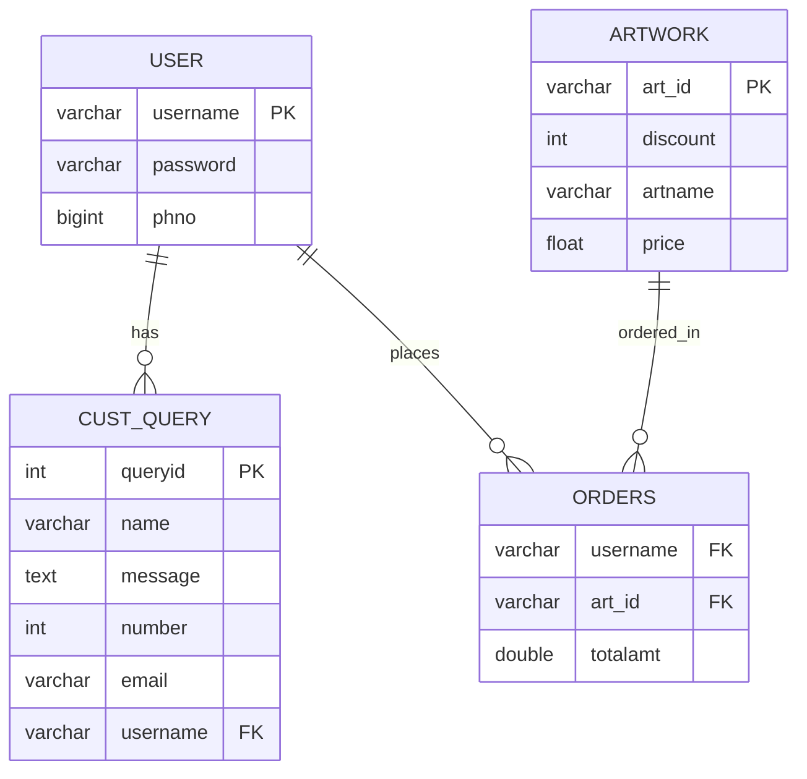

# Database Design — NeuralArtX

This document covers the relational design behind NeuralArtX: the ER model, the schema, normalisation to 3NF, and the SQL DDL.

---

## ER Diagram



**Entities and relationships:**
- A **User** can submit many **Customer Queries** (1:N)
- A **User** can place many **Orders**, and an **Artwork** can appear in many **Orders** (M:N, resolved via the `orders` junction table)

## Relational Schema

Four tables, each with a defined primary key:

| Table | Columns | Primary Key |
|-------|---------|-------------|
| `artwork` | art_id, discount, artname, price | `art_id` |
| `orders` | username, art_id, totalamt | (`username`, `art_id`) |
| `users` | username, password, phno | `username` |
| `cust_query` | queryid, name, message, number, email, username | `queryid` |

**Foreign keys:**
- `orders.username` → `users.username`
- `orders.art_id` → `artwork.art_id` (ON DELETE CASCADE, ON UPDATE CASCADE)
- `cust_query.username` → `users.username`

## Normalisation

### First Normal Form (1NF)
For a table to be in 1NF:
- Only atomic (single-valued) attributes
- Values in a column are of the same domain
- All columns have unique names

All four tables satisfy these conditions — no multi-valued or composite attributes exist.

### Second Normal Form (2NF)
For 2NF, there must be no partial dependency (a non-prime attribute depending on part of a candidate key).

**`artwork`** — candidate key: `art_id`
- art_id → discount, artname, price
- All non-prime attributes fully depend on the whole key. 

**`users`** — candidate key: `username`
- username → password, phno
- Full dependency. 

**`cust_query`** — candidate key: `queryid`
- queryid → name, message, number, email, username
- Full dependency. 

**`orders`** — candidate key: (`username`, `art_id`)
- (username, art_id) → totalamt
- `totalamt` depends on the full composite key, not a subset. 

No partial dependencies → already in 2NF.

### Third Normal Form (3NF)
For 3NF, there must be no transitive dependency (a non-prime attribute depending on another non-prime attribute).

In every table, all non-prime attributes depend directly on the primary key with no intermediate non-prime dependency:
- `artwork`: discount, artname, price each depend only on art_id
- `users`: password, phno depend only on username
- `cust_query`: name, message, number, email, username depend only on queryid
- `orders`: totalamt depends only on (username, art_id)

No transitive dependencies → already in 3NF. 

## SQL DDL

```sql
CREATE DATABASE project;
USE project;

CREATE TABLE users (
    username    VARCHAR(50) PRIMARY KEY,
    password    VARCHAR(255) NOT NULL,    -- bcrypt hash, not plaintext
    phno        BIGINT
);

CREATE TABLE artwork (
    art_id      VARCHAR(20) PRIMARY KEY,
    discount    INT,
    artname     VARCHAR(50),
    price       FLOAT
);

CREATE TABLE orders (
    username    VARCHAR(50),
    art_id      VARCHAR(20),
    totalamt    DOUBLE,
    payment_id  VARCHAR(100),            -- Razorpay payment ID
    PRIMARY KEY (username, art_id),
    FOREIGN KEY (username) REFERENCES users(username),
    FOREIGN KEY (art_id) REFERENCES artwork(art_id)
        ON DELETE CASCADE ON UPDATE CASCADE
);

CREATE TABLE cust_query (
    queryid     INT AUTO_INCREMENT PRIMARY KEY,
    name        VARCHAR(50),
    message     TEXT,
    number      BIGINT,
    email       VARCHAR(50),
    username    VARCHAR(50),
    FOREIGN KEY (username) REFERENCES users(username)
);
```

## Key Design Decisions

- **`password` is VARCHAR(255)** — bcrypt hashes are 60 characters, but 255 gives room if the hashing algorithm changes. Plaintext passwords are never stored.
- **`orders` uses a composite primary key** (`username`, `art_id`) — a user can only have one active order per artwork, preventing duplicate purchases.
- **`payment_id` in orders** — the Razorpay payment ID is stored alongside the order so every transaction has an auditable link back to the payment gateway.
- **CASCADE on artwork deletion** — if an artwork is removed from the catalog, its associated orders are cleaned up automatically rather than leaving orphaned rows.
- **`cust_query` has its own auto-increment PK** — customer queries are independent of the user/order flow and don't need a composite key.

---

← Back to [README](../README.md)
